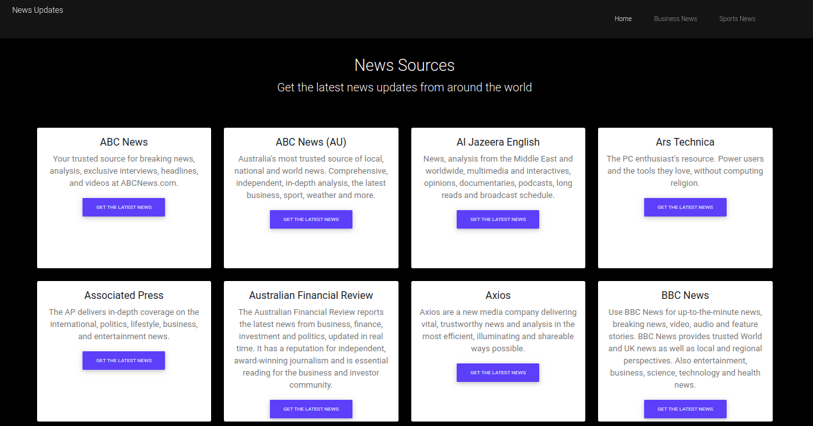

# News Update
This is a [website](https://newsapp26.herokuapp.com/) that provides the latest news updates from around the world 




## Author 
* Thomas Khaemba
  
## BDD(Behaviour Driven Development)
Given : That the user has access to the App
Then : The user can click on the buttons both on the home page and articles page
Expected: The button on the home page will direct the user to  articles and the buttons on  articles will direct the user  to the  full artcle on the source  website


## Installations
* python
* Flask
* virtual environment
* Flask-bootstrap
## Project Set Up
This project can be accessed by  setting up the environment  for running this application by installing the above technologies which are essential and then clone the project  and follow the steps below

First clone the repo  to your machine
```
$ git clone<repo>
```
Then get into  the project directory  you just cloned 
```
$ cd <project directory/folder>
```
To open the project on the Vscode or atom 
```
$ code ./atom .
```

And there you have the project to run it on the terminal write the following command

```
$ ./start.sh
```
## Technologies Used:
* Python-flask
* HTML
* Bootstrap
* CSS3
* newsApi
* 


## Contribution
You can contribute to the project by forking the project  and following the above steps of cloning the project


## Support and Contacts
For assistance,collaboration or query feel free to reachout tommybwah@gmail.com

## Copyright and License
Licensed under [MIT](license)